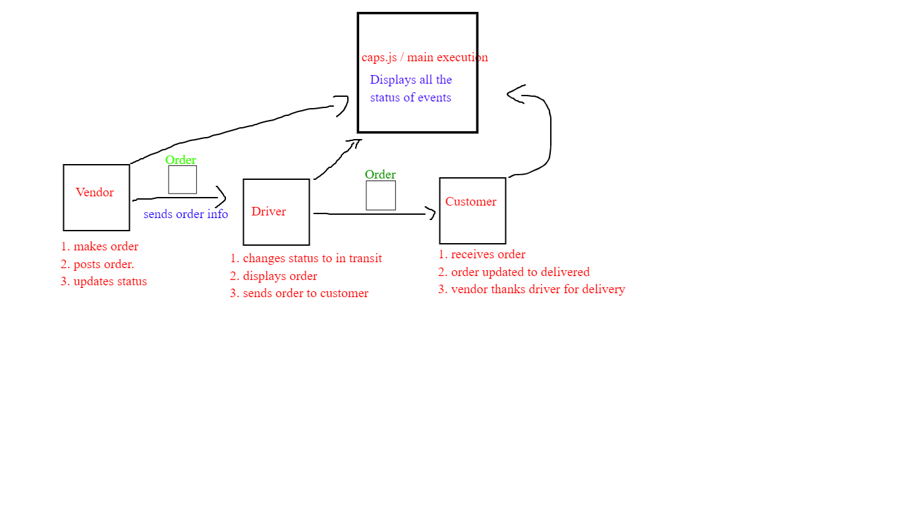

PULL REQ: https://github.com/yazanbaker94/auth-api/pull/2

DEPLOYMENT: https://auth-api-yazan-yazan.herokuapp.com/

DEPLOYED VERSION ON HEROKU: https://basic-auth-yazann.herokuapp.com/signup

How do I install the app or library?

Clone repo on your local machine
Enter terminal, cd into clone.
RUN NPM I FAKER

Run - node caps.js
You will see the result

How do I test the app or library? 

Clone repo on your local machine
Enter terminal, cd into clone.
Run - node caps.js
You will see the result

