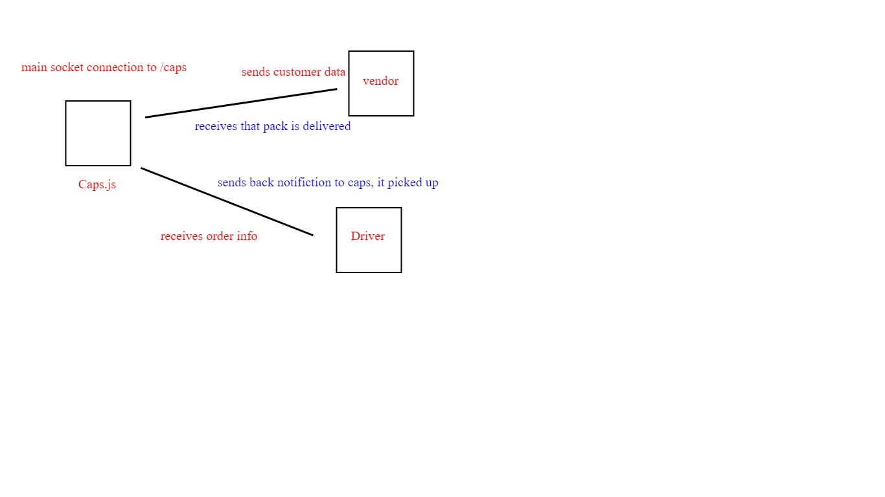

How do I install the app or library?

Clone repo on your local machine
Enter terminal, cd into clone.
RUN NPM I FAKER
run npm i socket.io
run npm i socket.io-client

Run - node caps.js
You will see the result

How do I test the app or library? 

Clone repo on your local machine
Enter terminal, cd into clone.
Run - node caps.js
You will see the result

